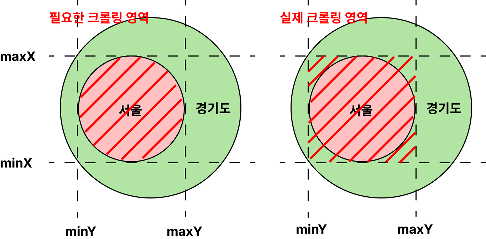

## 🤔 소개 : 국내 음식점 크롤러

`국내 85만개의 음식점 데이터`를 크롤링하는 크롤러입니다.

`17개의 행정구역(서울 ~ 제주도)`를 모두 순회하며 크롤링합니다.

 

크롤러는 `1차 크롤링`과 `2차 크롤링`으로 구성되어 있습니다.

`1차 크롤링`은 `음식점`과 `음식점 이미지`들을 크롤링합니다.

`2차 크롤링`은 1차 크롤링으로 얻은 음식점 id 를 사용하여 

각 음식점의 `메뉴`, `메뉴 이미지`, `리뷰`, `리뷰 이미지`, `영업시간`을 크롤링합니다.

 
 
 

## ⚙️ 구현 방식 : 스택을 활용한 반복 DFS 알고리즘

호스트 서버에 `4개의 좌표(최동단, 최서단, 최남단, 최북단)`와 `반환 개수`를 

쿼리 파라미터로 지정하고 요청하면 `최대 100개`의 음식점을 반환합니다.

이 점에 착안하여 `스택을 활용한 반복 DFS 알고리즘`으로 크롤러를 구현하였습니다.

(1) `100개 이상의 음식점`이 반환되면 해당 영역을 `4등분`하고 `스택에 푸시`합니다.

(2) `100개 미만의 음식점`이 반환되면 더 이상 영역을 쪼개지 않고 `삽입`합니다.

 
 
 

## ⚙️ 구현 방식 : 중복 크롤링 방지

특정 행정구역이 다른 행정구역을 감쌀 경우 중복 크롤링이 발생할 수 있습니다.

예를 들어, `서울` 을 타겟팅하여 크롤링할 경우 `경기도 음식점`까지 크롤링되고

이후 `경기도` 을 타겟팅하여 크롤링을 진행하면

동일한 음식점이 다시 한번 크롤링될 수 있습니다.

따라서 반환된 `음식점 주소`가 현재 `타겟팅한 행정구역`(서울)인지 검증해야 합니다.

이때 `주소`는 `음식점 이름`까지 포함하는데, `경기도 성남시 서울순대국` 처럼

`음식점 이름`에 `행정구역 이름`이 사용될 경우

`행정구역`이 `경기도`이지만 `음식점 이름`에 `서울`이 포함되어있기 때문에 

`서울` 을 타겟팅하여 크롤링하고 있음에도 불구하고 

`경기도` 음식점이 크롤링될 수 있습니다.

따라서 행정구역 `경기도`만 substring 하여 

행정구역으로만 검증하여 중복 크롤링을 확실히 방지합니다.

 
 
 

## ⚙️ 구현 방식 : 배치 삽입

국내에는 약 `85만개의 음식점`이 존재합니다.

이를 하나씩 삽입한다면 `85만번의 삽입`이 발생합니다.

`음식점` 외에도 `메뉴`, `리뷰` 등을 고려한다면 더 많은 삽입이 발생하게 될 것입니다.

이를 위해 반환된 데이터를 `배치`에 쌓아두고 

`배치 사이즈`에 도달하면 `배치 삽입`하도록 구현했습니다.

 
 
 

## ⚙️ 구현 방식 : IP 차단시 데이터 백업 및 복구

일정 횟수 이상으로 너무 많은 요청을 보내면 호스트 서버로부터 IP 가 `차단`됩니다.

이를 방지하기 위해 `데이터 백업 및 복구 로직`을 개발하였습니다.

아래와 같은 방식으로 백업 및 복구 로직이 이뤄집니다.

 
 
 

## 🔖 기타 사항

`1차 크롤링`에는 `최소 2일`이 소요되고, `2차 크롤링`에는 `최소 23일`이 소요됩니다.

학업 목적으로 사용하실 분은 이메일로 문의주시면 `.env` 파일을 전달해드리겠습니다.

해당 코드의 상업적 이용을 금지합니다.