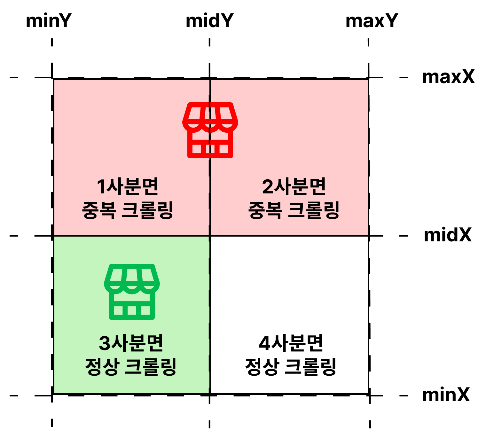

## 🤔 소개 : 국내 음식점 크롤러

`17개의 행정구역(제주도 ~ 서울)`을 모두 순회하며 크롤링합니다.

 

크롤러는 `1차 크롤링`과 `2차 크롤링`으로 구성되어 있습니다.

`1차 크롤링`은 `음식점`과 `음식점 이미지`들을 크롤링합니다.

`2차 크롤링`은 1차 크롤링으로 얻은 음식점 ID 를 사용하여 

각 음식점의 `메뉴`, `메뉴 이미지`, `리뷰`, `리뷰 이미지`, `영업시간`을 크롤링합니다.

 

`1개의 기기`로 `2주`동안 약 `85만 개의 음식점`, `4천만 로우의 데이터` 를 수집합니다.

<a href="https://www.atfis.or.kr/fip/front/M000000268/stats/service.do">2022년 음식점 통계 자료</a> 를 기반으로 추정한다면 

2025년에는 약 6만개의 음식점이 증가함을 확인할 수 있습니다.

 
 
 

## ⚙️ 구현 방식 : 스택을 활용한 반복 DFS 알고리즘

호스트 서버에 `4개의 좌표(minX, minY, maxX, maxY)`와 `반환 개수`를 

쿼리 파라미터로 지정하고 요청하면 `최대 100개`의 음식점을 반환합니다.

이 점에 착안하여 `스택을 활용한 반복 DFS 알고리즘`으로 크롤러를 구현하였습니다.

(1) `100개 이상의 음식점`이 반환되면 해당 영역을 `4등분`하고 `스택에 푸시`합니다.

(2) `100개 미만의 음식점`이 반환되면 더 이상 영역을 쪼개지 않고 `삽입`합니다.

 
 
 

## ⚙️ 구현 방식 : 좌표와 행정구역의 특성 차이로 발생하는 중복 크롤링 방지

`좌표` 는 `직선` 이지만, `행정구역` 은 `직선이 아니기` 때문에 중복 크롤링이 발생할 수 있습니다.

예를 들어, `서울` 을 타겟팅하여 크롤링할 경우 `경기도 음식점`까지 크롤링되고

이후 `경기도` 을 타겟팅하여 크롤링을 진행하면 동일한 음식점이 `중복 크롤링`될 수 있습니다.

따라서, 반환된 `음식점 주소`가 현재 `타겟팅한 행정구역`(서울)인지 검증해야 합니다.

이 때, `주소`는 `음식점 이름`까지 포함하기 때문에

`주소`에서 `행정구역`만 `substring` 하여 `행정구역`만 검증해야 합니다.

예를 들어, `서울` 크롤링시 `경기도 성남시 서울순대국` 주소에서 `경기도`를 기준으로 검증해야 합니다.

 
 
 

## ⚙️ 구현 방식 : 좌표에 걸쳐진 음식점이 존재할 경우 발생하는 중복 크롤링 방지

만약 쪼개어진 `좌표가 음식점에 걸쳐진다면 두 개의 사분면에서 모두 크롤링` 될 가능성이 있습니다.

따라서 `HashSet` 에 `음식점 아이디`를 저장하고 조회하여 중복 크롤링을 방지해야 합니다.

 
 
 

## ⚙️ 구현 방식 : 최대 4,950개의 음식점을 1번의 INSERT 로 저장

국내에는 약 `85만개의 음식점`이 존재합니다.

이를 하나씩 삽입한다면 최소 `85만번의 삽입`이 발생합니다.

`음식점` 외에도 `메뉴`, `리뷰` 등을 고려한다면 더 많은 삽입이 발생하게 될 것입니다.

이를 위해 반환된 데이터를 `배치`에 쌓아두고 

`배치 사이즈 (50)`에 도달하면 `배치 삽입`하도록 구현했습니다.

 
 
 

## ⚙️ 구현 방식 : IP 차단시 데이터 백업 및 복구

장시간 요청을 보내면 `호스트 서버가 IP 를 차단`시킵니다.

`얼마나 깊이(depth) 영역을 쪼개어 들어갔는지에 대한 정보를 백업` 하고 이를 `복구` 하여

크롤러를 재실행하더라도 차단 시점의 좌표부터 크롤링을 이어가기 위해

`데이터 백업 및 복구 로직`을 개발하였습니다.

아래와 같은 방식으로 백업 및 복구 로직이 이뤄집니다.

 
 
 

## ⚙️ 구현 방식 : IP 차단시 재시도

장시간 요청을 보내면 `호스트 서버가 IP 를 차단`시킵니다.

IP 가 차단되더라도 일정 시간 슬립한 이후 크롤링을 이어갈 수 있도록

`재시도 로직`을 개발하였습니다.

아래와 같은 방식으로 재시도 로직이 이뤄집니다.

 
 
 

## 🔖 기타 사항

`1차 크롤링`에는 `최소 7일`이 소요되고, `2차 크롤링`에는 `최소 23일`이 소요됩니다.

학업 목적으로 사용하실 분은 이메일로 문의주시면 `.env` 파일을 전달해드리겠습니다.

해당 코드의 상업적 이용을 금지합니다.
